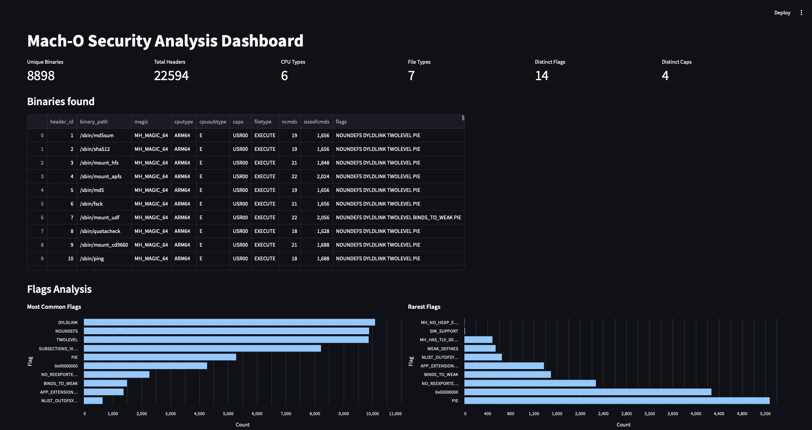

# Mach-O Harvester and Dashboard

## Overview



This project provides tools to analyze and visualize Mach-O binaries in a directory on macOS. It includes:
1.	Harvester Script: Recursively scans a specified directory, identifies Mach-O binaries, extracts their headers, and stores the data in an SQLite database.
2.	Streamlit Dashboard: A web-based dashboard to visualize and analyze the stored data.

## Prerequisites
1.	Python: Ensure you have Python 3.7 or higher installed.
2.	Dependencies: Install the required Python libraries:

```bash
pip install streamlit pandas altair
```

## Usage

The harvester script scans a directory for Mach-O binaries, extracts header information using otool, and stores the data in an SQLite database (`mach_o_binaries.db`) :

```bash
python3 machob_harvester.py <root_dir>
```

- `root_dir`: The root directory to scan (e.g., `/usr/bin`, `/sbin`, or `/` to scan the whole FS).

The dashboard visualizes the data collected by the harvester script. It provides insights into the Mach-O binaries, including their header fields, flags, and load commands :


```bash
streamlit run dashboard.py
```

After running this command, Streamlit will provide a URL (e.g., http://localhost:8501) where you can access the dashboard in your browser.


